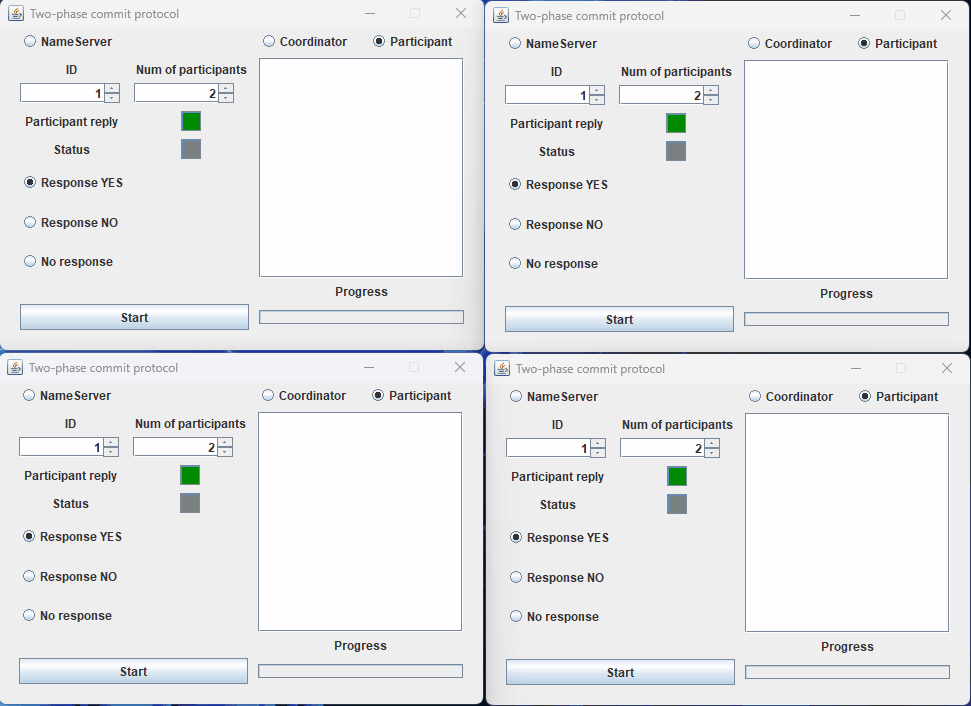

# Transactions in java

Colaborators:
* Ivona Čižić
* Mateo Martinjak

## About 

```
Transakcija je niz operacija nad podacima koje se ponašaju kao jedna nedjeljiva cjelina.
Istovremeno izvođenje više transakcija mora biti ekvivalentno nekom njihovom
sekvencijalnom izvođenju. Ako transakcija zbog greške ne dođe do kraja, tada se njezin
dotadašnji učinak mora neutralizirati (rollback). Ako je transakcija došla do kraja, tada se
njezin ukupni učinak mora trajno pohraniti (commit). U projektu treba obraditi problem
kontrole konkurentnog izvođenja transakcija, kao i tehnike za neutralizaciju transakcije u
slučaju kad je došlo do greške prije kraja njezinog izvođenja. No najveću pažnju u projektu
treba posvetiti problematici distribuiranog izvršavanja transakcije. Dakle ako se transakcija
sastoji od dijelova koji su raspoređeni na više procesa (računala), kako osigurati da svi ti
dijelovi složno naprave ili commit ili rollback? Riječ je o specifičnom problemu usuglašavanja.
U projektu treba objasniti, analizirati, implementirati i testirati poznati algoritam dvofaznog
pohranjivanja (two-phase commit). 
```
## Program example (num_of_nodes = 3)

### Sucessfull transaction commit
#### All nodes returned 'success' message back to master node.


### Failed transaction commit
#### First slave node returned 'failed' message back to master node.


## Run project
1. get the executable from [here](https://github.com/aeoden96-uni/transactions_java/releases/latest/download/transactions_java.jar)

2. Run in console:
```
java -jar ./transactions_java.jar num_of_nodes(optional)(if not given,only one GUI windows will start)
```

Example:
```
java -jar ./transactions_java.jar 3
```


3. To start a transaction, press Start in every window:

    1. Pick ```Name server``` and press ```Start```
    2. Pick ```master``` ,type in ```num_of_nodes``` and press ```Start```
    3. For every ```slave```  type in ```num_of_nodes``` and  ```id``` (1,2,3...) and press ```Start```
    
    
    
## Literature


Garg V.K. [Concurrent and Distributed Computing in Java](http://users.ece.utexas.edu/~garg/jbk.html) Wiley – IEEE Press CHAPTER 16

Robert Manger [Distribuirani procesi](http://web.studenti.math.hr/~manger/protect/DP-Skripta.pdf)

